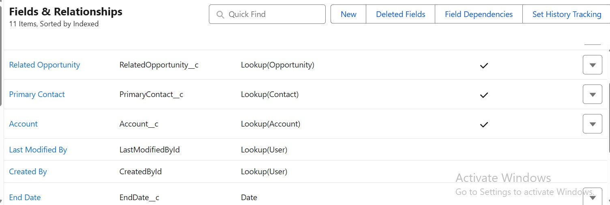
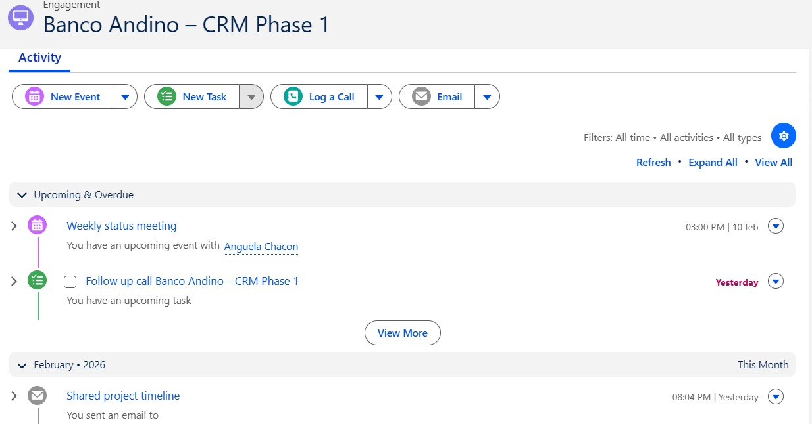
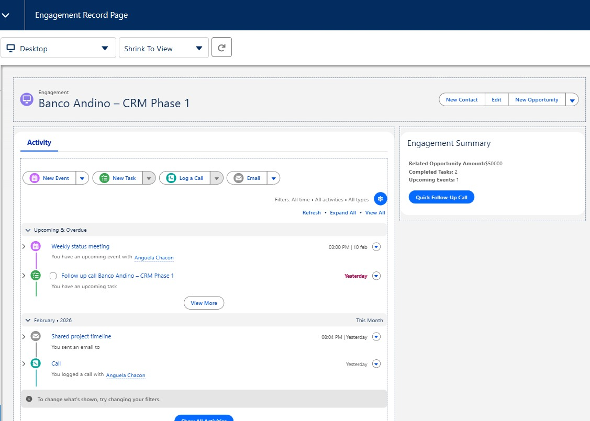
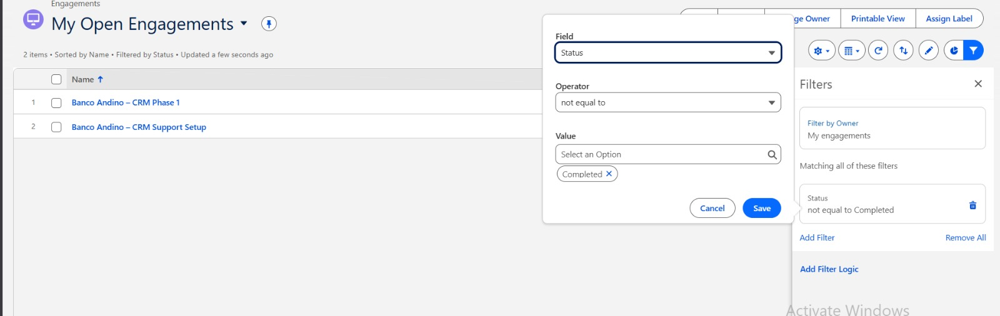
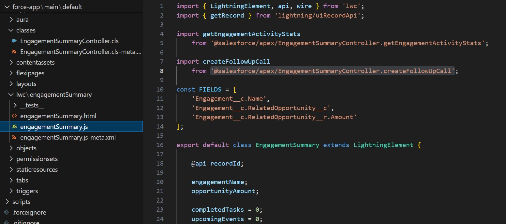
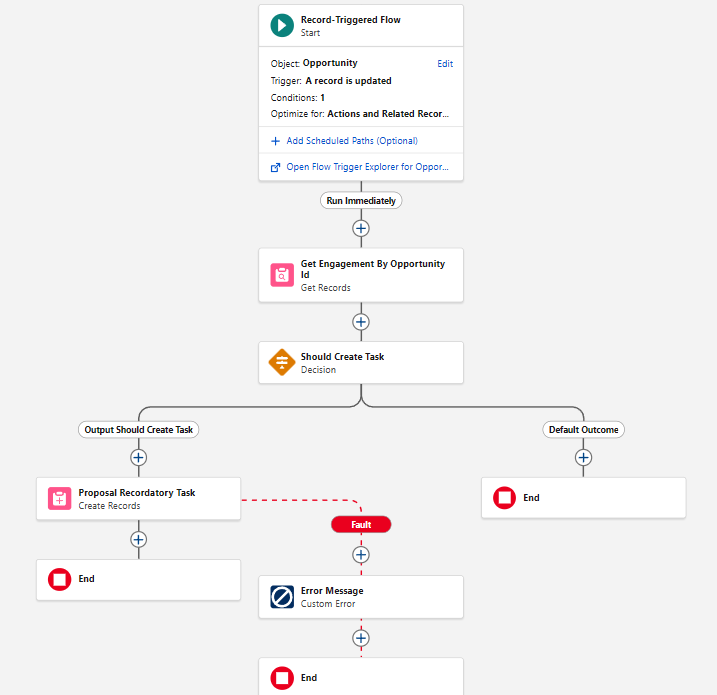
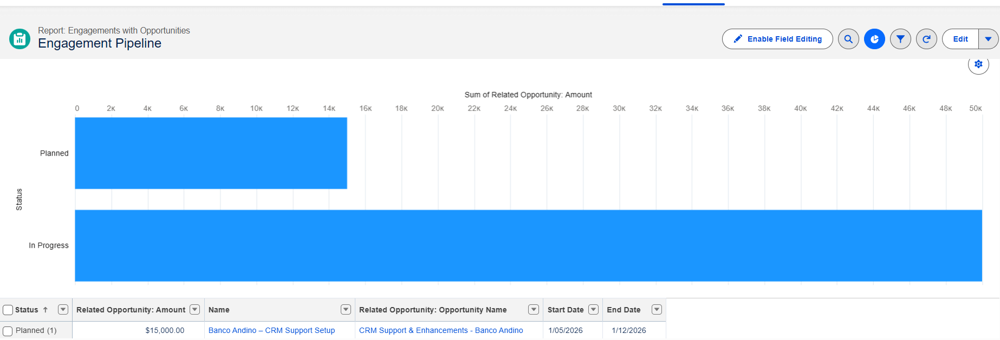
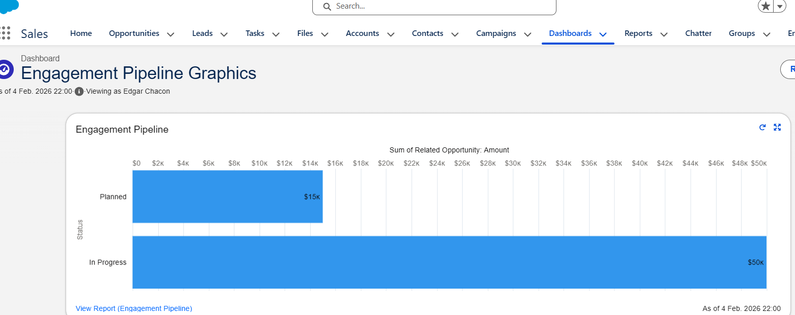

# Salesforce Engagement Management – Technical Assessment

[Video evidencia](https://drive.google.com/file/d/1CL8c34RBCraNEc9OQsaZIcgeHCLq3ncs/view?usp=sharing)

## Step 1 - Data Model

Se creó el objeto personalizado **Engagement (Engagement__c)** con los campos clave del contexto de negocio.
Los campos **Account, Status, Start Date y Name** se definieron como obligatorios por su relevancia operativa.
El objeto fue añadido correctamente a la **Sales App** mediante un *custom tab* para facilitar su acceso.

**Referencia:** [Ver evidencia – Data Model](#data-model)

## Step 2 - Activities

Se configuró y demostró el uso de **Activities** sobre **Engagements, Accounts y Opportunities**, incluyendo: Logged Calls, Tasks, Events y Emails.

Todas las actividades se visualizan correctamente en el **Activity Timeline**, simulando un flujo realista de trabajo comercial.

**Referencia:** [Ver evidencia – Activities](#activities)

## Step 3 - Engagement Record Page
Se diseñó y activó una **Lightning Record Page personalizada** para `Engagement__c` que incluye:

* **Highlights Panel** con información clave del Engagement
* **Activity Timeline** para el seguimiento de interacciones
* Un **Lightning Web Component (LWC)** personalizado para métricas y acciones rápidas

**Referencia:** [Ver evidencia – Record Page](#engagement-record-page)

## Step 4 - List Views & Chart

Se crearon las siguientes **List Views**:

* **My Open Engagements**: List View que filtra Engagements con status Completados
* **Engagements by Account**: List View Chart agrupado por **Account**, mostrando la **suma del Budget / Amount** para una visualización rápida.

**Referencia:** [Ver evidencia – List Views](#list-views--chart)

---

## Step 5 - Lightning Web Component – `engagementSummary`

Se desarrolló el LWC **`engagementSummary`**, el cual:

* Consume el **recordId** del Engagement actual
* Muestra:

  * Amount de la Opportunity relacionada
  * Conteo de Tasks completadas
  * Conteo de Events próximos
* Incluye la acción **Quick Follow-Up Call**, que crea una Task mediante Apex.

**Referencia:** [Ver evidencia – LWC](#lightning-web-component)

## Step 6 - Flow Automation

Se implementó un **Record-Triggered Flow** sobre **Opportunity** que:

* Se ejecuta cuando el **Stage** cambia a *Negotiation / Review*
* Valida que exista un **Related Engagement**
* Crea automáticamente una **Task** en el Engagement y si falla se crea un custom error.

Nota: Se evita el uso de **IDs hardcodeados**.

**Referencia:**
[Ver evidencia – Flow](#flow-automation)

## Step 7 - Reporting

Se creó el Custom Report Type *Engagements with Opportunities* y el reporte **Engagement Pipeline**, con:

* Engagement, Account, Status, Opportunity, Amount y fechas
* **Bar Chart**: Sum of Opportunity Amount por Engagement Status

Este reporte tiene el fin de analizar cómo se distribuyen los ingresos a lo largo del ciclo del Engagement. Ademas se incluyo dentro de dashboards el grafico reporting. 

**Referencia:**
[Ver evidencia – Reporting](#reporting)

**Referencia:**
[Ver evidencia – Reporting Opcional](#reporting-opcional)

## How to Test

Para poder comprobar que todo funcionaba correctamente hizo lo siguiente:
1. Cree un Engagement record y verique campos, asi como el aspecto visual (related lists y Activity Timeline)
2. Registre una Call, Event y Email
3. Valide cambios en List Views y List View Chart
4. Cambie un Opportunity Stage a *Negotiation / Review* y confirmar la creación automática de la Task
5. Verifique que el LWC actualiza los conteos correctamente
6. Revise el reporte y chart de Engagement Pipeline

## Asunciones Extras

* El **Engagement Budget** representa el valor de de cuanto se puede gastar y debe ser menor o igual al amount del opportunity.

## Paths

* **Apex Class:** `@salesforce/apex/EngagementSummaryController`
* **Get Stats:** `@salesforce/apex/EngagementSummaryController.getEngagementActivityStats`
* **Create Task:** `@salesforce/apex/EngagementSummaryController.createFollowUpCall`

## Apéndice – Evidencias Visuales

### Data Model

### Activities

### Engagement Record Page

### List Views & Chart

### Lightning Web Component

### Flow Automation

### Reporting

### Reporting Opcional

